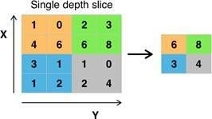

# 3️⃣ Digit Recognizer

A convolutional neural network (CNN) built using **PyTorch**, trained on the **MNIST handwritten digit dataset** for the Kaggle Digit Recognizer competition.  
The model reaches **98.6% validation accuracy** and a **0.987 Kaggle Public Score**, with **4.14× faster training** using Apple’s MPS GPU backend.

---

## Features
- CNN pipeline built from scratch using PyTorch  
- Efficient training with **Apple Metal Performance Shaders (MPS)** for GPU acceleration  
- Achieves **high accuracy (0.987 Kaggle score) with minimal epochs**  
- Lightweight architecture optimized for 28×28 grayscale inputs  
- Generates ready-to-submit Kaggle CSV predictions  

---

##  Input Example (What the Model Sees)

  
  
  
<em>Example 28×28 grayscale MNIST digit.</em>

A 28×28 grayscale image (1 channel). Each pixel is normalized and passed into the CNN as a tensor shaped **(1, 28, 28)**.

---

## Model Architecture
- Conv2d(1 → 32, kernel=3)   — learns edges + small patterns
- ReLU                       — removes negative 
- MaxPool2d(2)               — reduces spatial 
- Conv2d(32 → 64, kernel=3)  — learns higher level features
- ReLU  
- MaxPool2d(2)  
- Flatten (64×5×5 → 1600)  
- Linear 1600 → 128  
- ReLU  
- Linear 128 → 10  

---

## 🧠 How the CNN Learns Features

###  Convolution Layers Extract Edges & Curves  

  
  
<em>Convolution filters and feature maps capturing edges, strokes, and curves.</em>

The first conv layer learns **edges and straight segments** (/, \\, —).  
The second conv layer learns **bends, corners, and curves** needed to recognize digits like 3, 5, and 8.

---

##  Understanding ReLU (Why It Creates “Bends & Curves”)

  
  
<em>ReLU activation: negative values set to 0, positive values passed through, creating sharp changes in slope. </em>

Raw pixel values contain positive and negative information.  
**ReLU removes all negative values**, leaving only strong positive signals.  
This creates sharp changes in slope — the “kinks” that represent curves in handwritten digits.

Without ReLU → the model can only form straight-line behavior.  
With ReLU → the model can detect meaningful shape transitions such as:

These shape transitions help the CNN understand digits as combinations of **lines + bends + curves**.

---

## 🔍 Max Pooling: Keeping Only the Meaningful Parts

  
  
<em>Max pooling reduces spatial size while preserving the strongest activations.</em>

Max Pooling reduces image size while keeping the **strongest activations**.  
This helps the model focus on the most important features (like strokes of a digit) and ignore noise.

---

## CPU vs MPS GPU Training Speed

The same model was trained for **8 epochs** on CPU and on Apple’s MPS GPU.

<table>
  <tr>
    <th>Device</th>
    <th>Train Time (8 epochs)</th>
  </tr>
  <tr>
    <td>CPU</td>
    <td>89.08 seconds</td>
  </tr>
  <tr>
    <td>MPS GPU</td>
    <td>21.54 seconds</td>
  </tr>
  <tr>
    <td><strong>Speedup</strong></td>
    <td><strong>4.14× faster</strong></td>
  </tr>
</table>

---

## Results
- **Validation Accuracy:** 98.64%  
- **Best Kaggle Score:** 0.98728  
- **Best Epoch Count:** 8  

---

